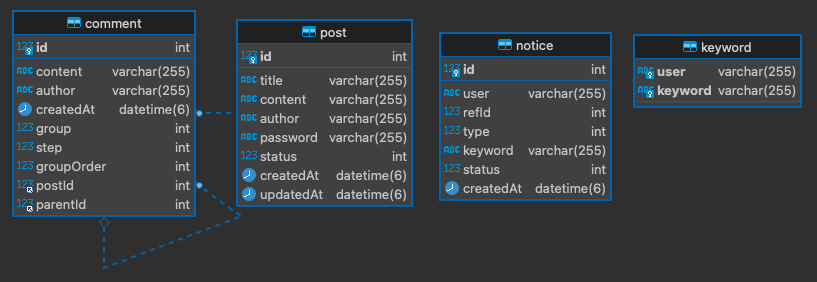

# 댓글 기능이 있는 익명 게시판 및 키워드 알림 기능 구현

## 1. 요구사항 정의
### - 게시판
- 제목, 내용, 작성자, 비밀번호, 작성일시, 수정일시로 테이블 구성
- 게시글 목록 API
  - 제목, 작성자로 검색
  - 페이징 기능
- 게시글 작성 API
  - 로그인 없이 작성자명 입력받아 게시글 작성
- 게시글 수정 API
  - 비밀번호 일치시에만 수정
- 게시글 삭제 API
  - 비밀번호 일치시에만 삭제
### - 댓글
- 내용, 작성자, 작성일시로 테이블 구성
- 댓글 목록 API
  - 페이징 기능
- 댓글 작성 API
  - 대댓글 작성
### - 키워드
- 사용자, 키워드로 테이블 구성
- 키워드 등록 API
- 키워드 삭제 API
### - 알림
- 사용자, 참조 아이디, 참조 타입, 키워드, 상태, 생성일시로 테이블 구성
- 알림 목록 API
  - 사용자에 대한 알림 목록
  - 페이징 기능
---
## 2. Database 엔티티 관계도


---
## 3. 개발 환경
- Node.js: v16.14.2
- Nest: v8.2.5
- MySQL: v8.0.28
---
## 4. 실행 방법
1. MySQL 설정
    - host: localhosst
    - port: 3306
    - username: root
    - password: 1234
    - database_name: anonymous_post
2. Node.js 패키지 설치 및 앱 실행
    - npm install
    - npm start
3. DB 기본 데이터 입력
    ``` SQL
    INSERT INTO anonymous_post.keyword (`user`,keyword) VALUES
     ('user1','apple'),
     ('user2','banana');

    INSERT INTO anonymous_post.post (title,content,author,password,status,createdAt,updatedAt) VALUES
     ('post1','post1','user1','1234',0,'2022-07-01 15:06:13.004325000','2022-07-01 15:06:13.004325000'),
     ('post2','post2 banana','user1','1234',0,'2022-07-01 15:06:22.674394000','2022-07-01 15:06:22.674394000'),
     ('post3','post3 apple','user2','1234',0,'2022-07-01 15:06:32.392990000','2022-07-01 15:06:32.392990000');

    INSERT INTO anonymous_post.comment (content,author,createdAt,`group`,step,groupOrder,postId,parentId) VALUES
     ('comment 1','user2','2022-07-01 15:07:43.147059000',1,0,0,1,NULL),
     ('comment 2','user2','2022-07-01 15:07:48.211765000',2,0,0,1,NULL),
     ('comment 1-1','user1','2022-07-01 15:07:59.820746000',1,1,1,1,1),
     ('comment 1-2','user2','2022-07-01 15:08:05.282581000',1,1,4,1,1),
     ('comment 1-2-1 banana','user1','2022-07-01 15:08:41.692348000',1,2,5,1,4),
     ('comment 1-2-2','user1','2022-07-01 15:08:49.538622000',1,2,6,1,4),
     ('comment 1-1-1','user2','2022-07-01 15:09:02.212339000',1,2,2,1,3),
     ('comment 1-1-2 apple','user2','2022-07-01 15:09:12.721243000',1,2,3,1,3);

    INSERT INTO anonymous_post.notice (`user`,refId,`type`,keyword,status,createdAt) VALUES
     ('user2',2,0,'banana',0,'2022-07-01 15:06:22.686942000'),
     ('user1',3,0,'apple',0,'2022-07-01 15:06:32.413070000'),
     ('user2',5,1,'banana',0,'2022-07-01 15:08:41.705863000'),
     ('user1',8,1,'apple',0,'2022-07-01 15:09:12.736635000');
    ```
---
## 5. API 명세(swagger)
- http://localhost:3000/api/
---
## 6. To do (2022. 07. 02 기준)
1. TypeORM repository 패턴으로 리팩터링
    - 데이터 로직과 비즈니스 로직을 분리하여 재사용성 향상
    - 단위 테스트를 통한 검증 가능
    - 객체 간 결합도 감소
1. 커스텀 미들웨어 활용하여 AOP 적용
    - 로깅
    - 성공/실패 동일한 response 형태로 반환
1. 테스트 케이스 작성
    - express 기반으로 TDD 공부 후 Nest 기반으로 TDD 공부
1. Database 설정
    - 한국 시간 설정
    - TypeOR에서 스키마 재정의
        - author/user 크키 변경
        - content 크기 변경
    - TypeORM Migration 적용
1. 도커 환경으로 구성
1. 기능 수정
    - 댓글 정렬 처리 다시 생각해보기
    - 